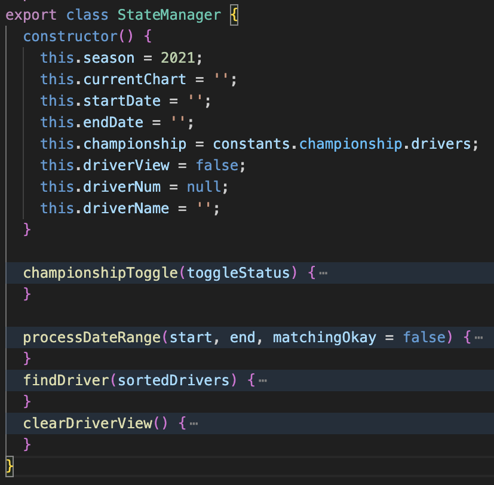

# F1 Standings Explorer

F1 Standings Explorer is a single page application for exploring Formula 1 seasons results. When F1 fans look up the season standings online, they usually find a simple table with the current total. F1 Standings offers new F1 fans and long time fans the option to explore season standings of the current season and previous seasons via data visualizations and interactive graphs and tables. How close was the WDC championship halfway through the year in 2021? How often did Charles not win a race when he got pole in 2022? Who was leading the constructor's championship in 2020? All of those questions can be answered with graphs using the F1 Standings Explorer web app.

[F1 Standings Explorer Live Site](http://juliouribe.github.io/F1StandingsExplorer/)

## Technologies Used
F1 Standings Explorer is a fully functional web app built using JavaScript, HTML, and CSS. I used [Chart.JS](https://www.chartjs.org/) for plots and [Ergast API](https://ergast.com/mrd/) for data.

# Features
## Driver's Championship Graphs
F1 Standings Explorer creates visualizations that show how an F1 season played out. Two plots are generated for the Driver's championship. The first is a line graph showing the points total for each driver. Data is rendered by parsing json data pulled from the F1 API. The web app uses caching so repeated pulls and filtering are quick.

A driver's position table summary is also generated. This data is rendered from the same data that renders the line-graphs and is updated when a user filters data.

## Data Filtering Options
### Summary
F1 Standings Explorer provides users the option to select different seasons of F1 and filter for date ranges. You also have the option to toggle between the World Driver's Championship or the World Constructor's Championship. Date is updated and plots are regenerated using the filtered data. In the example below we can see how large Charles Leclerc's lead was after Miami in 2022. Max Verstappen was making a huge surge and we can see how the championship was tightening.

## Constructor's Championship
Users can toggle to see the Constructor's Championship. The linegraphs update so we can view how each team performed through the year. User's can filter for date ranges and select different seasons just like the WDC graphs. In the example below, we can see how neck and neck Mercedes and Redbull were all year with Mercedes ultimately taking the WCC trophy.

## Driver Detail View
While on the Driver's Champion view, users can click on an individual driver to pull up their qualifying results and race finish results for each race. A bar chart is generated showing the results for each race. In the example below we can look at Sergio Perez who is under a lot of scrutiny in 2023 for having poor qualifying results. The bar charts however show he's doing a great job recovering positions on race day. For example, in Austria Checo started in 15th but by the end of the race he made it onto the podium getting 3rd.

# Challenges
## Managing State
There are a lot of options for what will get rendered, when to filter, what defaults to use, etc. I came up with a pretty nice solution so things don't reset or get lost unexpectedly when interacting with the filters. I used a class called StateManager which acts very similarly to a Singleton. There is only one instance of this class and it gets accessed across the code base so we have consistent filter values across the entire application. It also have a few methods to dry up code and carefully handle changing values.

## Caching and loading data
F1 Standings Explorer parses a lot of data which can potentially cause a lot of down times for users. For each season of Forumla 1 we are querying and parsing hundreds of races results. To solve this, I used two local data files so the default select season renders almost instantly. If we choose seasons that are not available locally, we query the Ergast API. The first time rendering is slow but future API calls are cached so they load instantly. I used Javascript's localStorage to track which seasons have already been queried and are available.

## Parsing JSON data and generating dynamic graphs
One challenge was coming up with efficient code that parses the json data returned from the API into meaningful summaries but is also compatible with populating two types of graphs. I came up with good parsing algorithms to parse hundreds of race results and group them by driver, tally points totals, and order them by position in the championship. I made these functions modular so we can apply dynamic filters and still return accurate totals.

See "/src/scripts/parsing-functions.js" for well documented parsing code.
