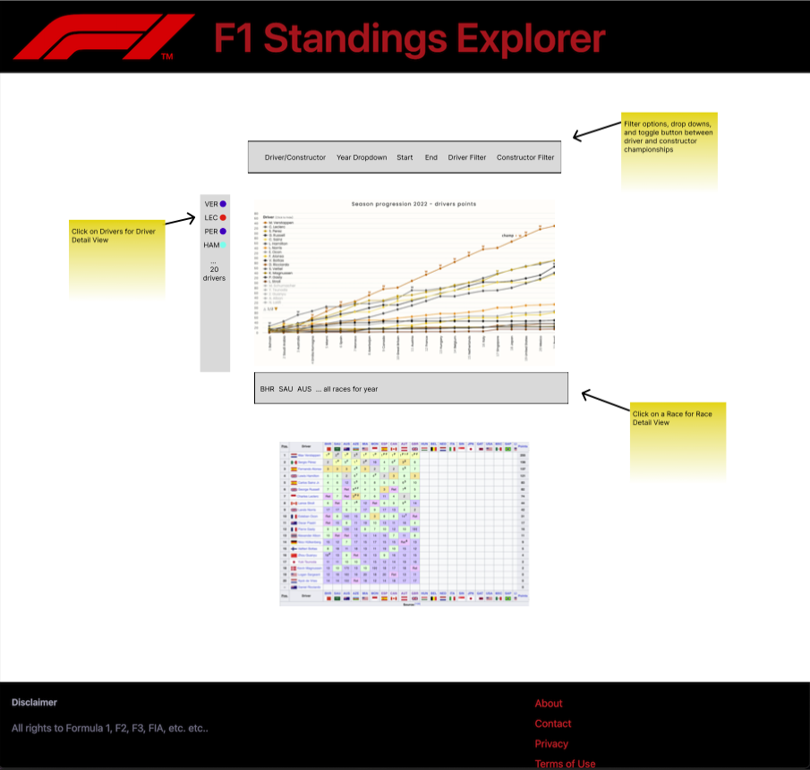

# F1 Standings Explorer

## Overview

I would like to make an F1 Standings Explorer web page. Most standings results for F1 are simple points totals that don’t really convey how a season played out. I would like to make a line graph for a given year to show how each driver accumulated points. If you don't know how F1 points are accumulated, I have a short summary below.

I want to make the webpage interactive by letting users click and explore results further. Users will be able to click into a driver and get more detailed results for that year. The driver detail view will show qualifying and finish race position for each race. I would also like to have a race detail view to show driver position changes lap by lap. These interactive graphs are a great example of using JavaScript and an API to create interactive data visualizations.

### How the F1 Championship Works
There are 10 teams and 20 drivers, two drivers per team, that participate in about 20 races per season. Each race, the top 10 positions are awarded points, with the 25 points going to the winner and the 10th place driver getting a single point. The driver with the most points at the end of the season wins the World Driver's Championship. The team with the most points, combining both drivers, wins the World Constructors's Championship.

Over the course of a weekend drivers participate in Friday practice, Saturday Qualifying, and Sunday race. Qualifying doesn't give points but it determines where you start on race day. Fans place a lot of emphasis on how well drivers qualify but the race finish is where points are awarded. Both are important and tell their own story.

### Race Finish Points Breakdown
| Position | Points |
| - | - |
| 1st | 25 |
| 2nd | 18 |
| 3rd | 15 |
| 4th | 12 |
| 5th | 10 |
| 6th | 8 |
| 7th | 6 |
| 8th | 4 |
| 9th | 2 |
| 10th | 1 |

## Functionality and Features
F1 Standings Explorer will provide interactive data visualizations for users to explore and get a high level overview of how a F1 season played out.

### Main Page: Season Summary
The main page will be a line graph to summarize points earned over the course of the season per driver. It will have the option select different years, filter drivers, filter teams, give a start date and end date to adjust the x-axis, and toggle between the Driver's Championship and the Constructor's Championship.

The x-axis represents the results from a given race. The y-axis represents the points total and each driver will be a different color respective to team colors. For example, Ferrari's Charles Leclerc will be red like his team and the second driver will be a lighter shade of red. Each team has generally distinct colors. If the graph is crowded users can filter out drivers or teams.

### Driver Detail View: Season Summary with Qualifying Results and Race Finish
Users will be able to click on a driver from the main page to pull up a more in depth view for just that driver. This graph will show qualifying results along with race finish for each race. This view is useful for seeing if a driver typically finishes where they qualify. Some drivers drop down the order while others climb up the field.

The x-axis still represents each race but I'll have two bar charts per race to show where they qualified and where they finished. The y-axis still represents the points total over the course of the season. I'll add a line graph on top of the bar chart.

### (BONUS) Race Detail View: Lap by Lap Positions Summary
Users will be able to click on a given race from the main page to pull up a more detailed view of a given race. It will provide a summary of grid positions over the course of the race, lap by lap.

The x-axis will represent the laps for the specific race. The y-axis will represent the grid positions in a static manner. First will be at the top, then second, all the way down to 20th. The line graphs will follow a driver as they move up and down positions over the course of the race. Pit stops and drivers overtaking will be visible on this graph as positions shift.

## Mock Up
[Figma Link](https://www.figma.com/file/DlCbUDeggzNDlML5IATI4F/F1StandingsExplorer?type=design&node-id=0-1&mode=design&t=IND9IRyf0LvhB480-0)
### Season Summary Main Page

### Driver Detail View

### Race Detail View

## Technologies, Libraries, APIs
I will be getting data from [Ergast API](http://ergast.com/mrd/). The guidelines for using this API include no more than 4 requests per second (avoid spam) or 200 times per hour. A unique API key is not required.

I will most likely be using [Chart.JS](https://www.chartjs.org/) for data visualizations. I only really need bar charts, and line charts. Might look for some nice style options or potential animations.

To avoid spamming the API too much I may download some of the data from the F1 API and keep it in a local file. I plan to "cache" queries by saving to JavaScript local storage.

## Implementation Timeline
| Date | Goal |
| - | - |
| Friday Afternoon | Build layout, basic season summary plot for a single year, use local data file, and basic styling |
| Monday | Create Season Summary Main Page Plot with filters and interactive buttons |
| Tuesday | Finish Driver Detail View and complete 70% of all styling |
| Wednesday | Finish Race Detail View and 95% of all styling |
| Thursday Morning | Verify functionality and optimize queries where possible |
